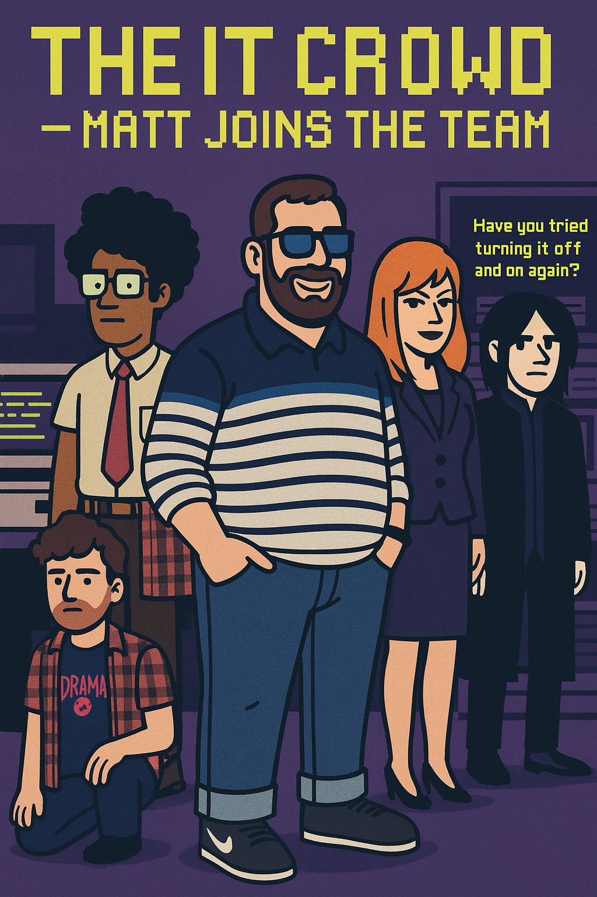

# 🎬 Fan Page - The IT Crowd

Este proyecto es una **Fan Page dedicada a la serie británica _The IT Crowd_**, desarrollada como práctica de **Diseño y Desarrollo Web**.  
Incluye páginas sobre los personajes, capítulos destacados y un formulario de contacto, todo con un diseño retro inspirado en la estética de la serie.

---

## 📂 Estructura del proyecto

- `index.html` → Página principal con bienvenida, banner y descripción de la serie.  
- `Personajes.html` → Cards individuales de cada personaje (Roy, Moss, Jen, Richmond, Douglas y Matt).  
- `Capitulos.html` → Lista de episodios destacados con videos embebidos en cards. Incluye un enlace al canal oficial de YouTube.  
- `contacto.html` → Formulario de contacto estilo retro para fans.  
- `Style.css` → Estilos globales del sitio (tema retro, colores verde Matrix, naranja y amarillo).  
- Carpeta `imagenes/` → Contiene todos los recursos gráficos (personajes, banners y logos).

---

## 🎨 Características principales

- **Diseño retro/pixelado** inspirado en _The IT Crowd_ (verde Matrix + tipografía arcade).  
- **Cards individuales** para personajes y capítulos, con tamaños de imágenes uniformes.  
- **Videos embebidos de YouTube** en capítulos destacados.  
- **Enlace al canal oficial**: [The IT Crowd Channel](https://www.youtube.com/@TheITCrowdChannel).  
- **Formulario de contacto** para interacción de usuarios.  
- **Responsive Design**: se adapta a distintos tamaños de pantalla.  

---

## 🛠️ Tecnologías utilizadas

- **HTML5**  
- **CSS3**  
- **Google Fonts (Press Start 2P)** para el estilo retro/pixelado.  
- **YouTube Embed** para insertar episodios.  

---

## 📸 Capturas de pantalla

### 🔹 Página principal


### 🔹 Personajes


### 🔹 Capítulos


---

## 🚀 Cómo usar

1. Clonar el repositorio:
   ```bash
   git clone https://github.com/mattposs/Desarrollo-DisenoWeb_NM_MPP_Clase2.git
